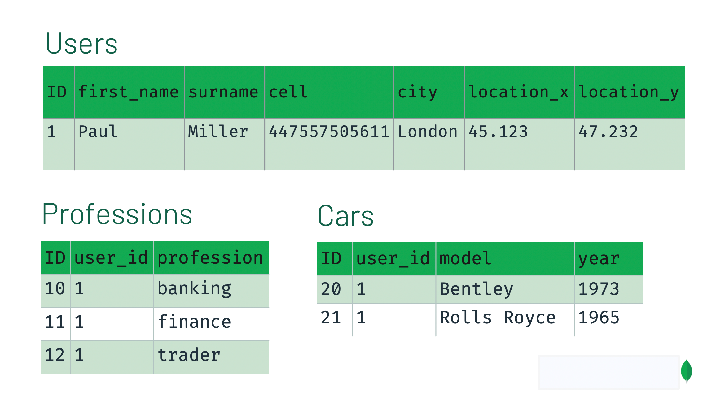

# <font color="#fca61c">🥇 Các Yếu Tố Khi Design</font>

- Ứng dụng có tính `read` hay `write` cao hơn ?

- `Data` nào thường được truy cập cùng nhau ?

- `Data` sẽ tăng và mở rộng như thế nào ?

- Các yếu tố về hiệu suất, bao gồm time truy vấn, time ghi, time đọc, time cập nhật, time xóa và time tải.

- Các yếu tố về bảo mật, bao gồm quyền truy cập, quyền đọc, quyền ghi, quyền cập nhật và quyền xóa.

- Các yếu tố về khả năng mở rộng, bao gồm khả năng mở rộng theo chiều ngang và khả năng mở rộng theo chiều dọc.

<br>

# <font color="#fca61c">🥇 Thiết Kế Database - Relational vs MongoDB</font>

## <font color="#C0C0C0">🥈 SQL Database Design</font>

- Khi thiết kế `Schema` cho một `Relational Database`, chia data thành các `table`, và đảm bảo không bị nhân đôi `data`.

- Các `Table` riêng biệt có theo một quy tắc chung, và có thể được `JOINED` với nhau bằng sử dụng `khóa ngoại` trong column `user_id` của `Professions` và `Cars`

  

<br>

## <font color="#C0C0C0">🥈 MongoDB Database Design</font>

🆗<font color="#1caafc">Special</font>🆗

<font color="#1caafc"> =========================================================================== </font>

- Khi bạn thiết kế cơ sở data bằng `MongoDB`, bạn chỉ cần quan tâm là thiết kế đó hoạt động tốt cho ứng dụng của bạn là được.

- 2 App khác nhau, sử dụng `data` giống hệt nhau nhưng có thể nó sẽ có những `schema` khác nhau. Đơn giản vì 2 app đó được sử dụng theo những cách khác nhau.

- <font color="#15cf24">_Không_</font>:

  - Không có quy trình chính thức

  - Không có thuật toán

  - Không có rules

- <font color="#15cf24">_Quan Tâm_</font>:

  - Lưu `data`

  - Cung cấp hiệu suất tốt khi `query`

  - Yêu cầu phần cứng hợp lý

  <font color="#1caafc"> =========================================================================== </font>

<br>

🥑 **<font color="#15cf24">SAMPLE</font>**

```json
{
  "first_name": "Paul",
  "surname": "Miller",
  "cell": "447557505611",
  "city": "London",
  "location": [45.123, 47.232],
  "profession": ["banking", "finance", "trader"],
  "cars": [
    {
      "model": "Bentley",
      "year": 1973
    },
    {
      "model": "Rolls Royce",
      "year": 1965
    }
  ]
}
```

<br>

## <font color="#C0C0C0">🥈 Embedding & Referencing</font>

- Khi thiết kế `schema` cho `MongoDB`, chúng ta sẽ đứng ở giữa 2 lựa chọn là `Embedding` hay `Referencing`, hay còn gọi là Embedding và Referencing.

- `Embedding` là đưa hết `data` vào trong một `document`
- `Referencing` là lưu trữ `data` trong một `document` thuộc `collection` riêng biệt và Referencing đến nó thông qua việc sử dụng `khóa ngoại` và toán tử `$lookup` (tương tự `JOIN` trong `SQL`).

<br>

### <font color="#cd7f32">🥉 Embedding</font>

- <font color="#15cf24">Pros</font>:

  - Bạn có thể truy xuất tất cả thông tin liên quan trong một `query`

  - Tránh việc `join` hoặc `lookup` trong ứng dụng

  - `Update` các thông tin liên quan trong một `query` duy nhất

- <font color="#15cf24">Cons</font>:

  - Khi `document` lớn lên sẽ gây gánh nặng cho những trường không liên quan. Bạn có thể tăng hiệu suất truy vấn bằng cách hạn chế kích thước của các `document` mà bạn gửi qua cho mỗi truy vấn.

  - Giới hạn cho `document` là `16 MB` trong `MongoDB`. Nếu bạn Embedding quá nhiều `data` bên trong một `document` duy nhất, bạn có thể đụng phải giới hạn này.

<br>

### <font color="#cd7f32">🥉 Referencing</font>

- <font color="#15cf24">Pros</font>:

  - Bằng cách chia `data`, bạn sẽ có các `document` nhỏ hơn.

  - Ít khả năng đạt giới hạn `16-MB` cho mỗi `document`.

  - Những `data` không cần thiết sẽ không được đính kèm vào các truy vấn.

  - Giảm lượng trùng lặp `data`. Tuy nhiên, điều quan trọng cần lưu ý là đôi khi chúng ta chấp nhận trùng lặp `data` để đem lại một `schema` tốt hơn.

- <font color="#15cf24">Cons</font>:

  - Để truy xuất được hết `data`, chúng ta cần tối thiểu là 2 `query` hoặc dùng `$lookup`

<br>

## <font color="#C0C0C0">🥈 Các Loại Quan Hệ</font>

🆗<font color="#1caafc">Special</font>🆗

<font color="#1caafc"> =========================================================================== </font>

- 5 Rules khi thiết kế `schema` cho `MongoDB`

  - <font color="#15cf24">_Quy tắc 1_</font>: Ưu tiên `Embedding` trừ khi chúng ta có một lý do thuyết phục để không làm như vậy

  - <font color="#15cf24">_Quy tắc 2_</font>: Khi cần truy cập vào một đối tượng riêng biệt, đây là lúc không dùng `Embedding`

  - <font color="#15cf24">_Quy tắc 3_</font>: Tránh `joins/lookups` nếu có thể, nhưng cũng đừng sợ nếu nó giúp chúng ta có một `schema` tốt hơn

  - <font color="#15cf24">_Quy tắc 4_</font>: `Array` không nên phát triển không giới hạn.

    - Nếu có hơn vài trăm `document` ở phía `"nhiều"` thì đừng `Embedding` chúng

    - Nếu có hơn vài ngàn `document` ở phía `"nhiều"` thì đừng sử dụng `array ObjectID Referencing`. `Array` với số lượng lớn `item` là lý do không nên dùng `Embedding`.

  - <font color="#15cf24">_Quy tắc 5_</font>: Với `MongoDB`, cách bạn mô hình hóa `data` phụ thuộc vào cách bạn sử dụng `data`. Bạn muốn cấu trúc `data` của bạn phù hợp với cách mà ứng dụng của bạn `query` và `update` nó.

<font color="#1caafc"> =========================================================================== </font>

<br>

### <font color="#cd7f32">🥉 Quan hệ 1-1 (One-to-One)</font>

- Chúng ta có thể mô hình hóa quan hệ `1-1` bằng cặp `key-value` trong `database`

- 1 user thì chỉ có 1 email đăng ký duy nhất và ngược lại, thì đây nghĩa là quan hệ `1-1`.

- 1 user và 1 car license: 1 người chỉ có 1 bằng lái xe, và 1 bằng lái xe chỉ thuộc về 1 người. Đây cũng là quan hệ `1-1`.

```json
{
  "_id": "ObjectId('AAA')",
  "name": "Joe Karlsson",
  "email": "joe@gmail.com",
  "company": "MongoDB",
  "twitter": "@JoeKarlsson1",
  "twitch": "joe_karlsson",
  "tiktok": "joekarlsson",
  "website": "joekarlsson.com"
}
```

<br>

### <font color="#cd7f32">🥉 Quan hệ 1 - Ít (One-to-Few)</font>

- 1 user có 1 vài address nhận hàng, thì đây là quan hệ `1 - ít`.

- Uu tiên Embedding cho quan hệ `1 - ít`

- Với quan hệ `1 - ít` thì chúng ta có thể `Embedding array` bên trong object User như sau:

```json
{
  "_id": "ObjectId('AAA')",
  "name": "Joe Karlsson",
  "company": "MongoDB",
  "twitter": "@JoeKarlsson1",
  "twitch": "joe_karlsson",
  "tiktok": "joekarlsson",
  "website": "joekarlsson.com",
  "addresses": [
    { "street": "123 Sesame St", "city": "Anytown", "cc": "USA" },
    { "street": "123 Avenue Q", "city": "New York", "cc": "USA" }
  ]
}
```

<br>

### <font color="#cd7f32">🥉 Quan hệ 1 - Nhiều (One-to-Many)</font>

- 1 bycycle với rất nhiều materials bên trong. Số lượng các chi tiết có thể lên đến hàng ngàn chi tiết (bánh xe, đèn, phanh, đồng hồ, còi, v.v.) - tưởng tượng mỗi cái bánh xe, đèn này chỉ thuộc về cái xe đạp này thôi. Vậy thì đây là quan hệ `1 - nhiều`.

  

- Yêu cầu của website là khi vừa vào trang chi tiết sản phẩm, thì hãy show ra thông tin sơ bộ của sản phẩm đó, và các chi tiết của sản phẩm đó. Chúng ta có thể click vào từng phần của cái xe để xem thông tin chi tiết của nó.

  - Với kiểu `1 - nhiều` nếu dùng `Embedding` thông thường thì rất dễ `document` của chúng ta sẽ chạm đến giới hạn.

  - Vậy nên giải pháp là tách những thành phần kia thành 1 `collection` riêng biệt gọi là `Parts`.

- `Products` và `Parts` sẽ liên kết với nhau thông qua `id`

  - Collection Products:

    ```json
    {
      "name": "left-handed smoke shifter",
      "manufacturer": "Acme Corp",
      "catalog_number": "1234",
      "parts": ["ObjectID('AAAA')", "ObjectID('BBBB')", "ObjectID('CCCC')"]
    }
    ```

  - Collection Parts:

    ```json
    {
      "_id": "ObjectID('AAAA')",
      "partno": "123-aff-456",
      "name": "#4 grommet",
      "qty": "94",
      "cost": "0.94",
      "price": " 3.99"
    }
    ```

<br>

### <font color="#cd7f32">🥉 Quan hệ 1 - Rất nhiều (One-to-Abundant)</font>

- Điều gì sẽ xảy ra nếu chúng ta có 1 `schema` mà có khả năng có đến hàng triệu các `document` phụ thuộc. Liệu có trường hợp nào có đến hàng triệu, hàng tỉ `document` phụ thuộc không? Câu trả lời là có, và nó rất thực tế.

- 1 ứng dụng ghi log server. Mỗi máy chủ có thể lưu trữ hàng tỉ message log.

  - Nếu dùng `array` trong `MongoDB`, cho dù các bạn đã dùng `array ObjectID` thì cũng có khả năng các bạn chạm đến giới hạn là `16 MB` cho `document`.

  - Vậy nên chúng ta cần suy nghĩ lại cách thiết kế làm sao cho khi `database` phình to ra thì vẫn không bị giới hạn.

  - Bây giờ, thay vì tập trung mối quan hệ giữa host và log message, chúng ta hãy nhìn ngược lại, mỗi log message sẽ lưu trữ một host mà nó thuộc về. Bằng cách này thì chúng ta sẽ không sợ bị giới hạn bởi `16 MB` nữa.

- Hosts và Log Message sẽ liên kết với nhau thông qua `id`

  - Collection Hosts:

    ```json
    {
      "_id": ObjectID("AAAB"),
      "name": "goofy.example.com",
      "ipaddr": "127.66.66.66"
    }
    ```

  - Collection Log Message:

    ```json
    {
      "time": ISODate("2014-03-28T09:42:41.382Z"),
      "message": "cpu is on fire!",
      "host": ObjectID("AAAB")
    }
    ```

<br>

### <font color="#cd7f32">🥉 Quan hệ Nhiều - Nhiều (Many-to-Many)</font>

- `Schema Pattern` cuối cùng là mối quan hệ `nhiều-nhiều`. Đây là kiểu mà chúng ta rất hay gặp trong thực tế.

- Ví dụ chúng ta build một app todo list, một user có thể có nhiều task, và một task có thể có nhiều user được assign vào.

- Lúc này chúng ta cần `Referencing` qua lại giữa các `collection`.

- Từ ví dụ này, chúng ta có thể thấy mỗi user có 1 `sub array` các `ObjectID task`, và mỗi task cũng có 1 `sub array` các `ObjectID owners`.

- Users và Tasks:

  - Collection Users:

    ```json
    {
      "_id": ObjectID("AAF1"),
      "name": "Kate Monster",
      "tasks": [ObjectID("ADF9"), ObjectID("AE02"), ObjectID("AE73")]
    }
    ```

  - Collection Tasks:

    ```json
    {
      "_id": ObjectID("ADF9"),
      "description": "Write blog post about MongoDB schema design",
      "due_date": ISODate("2014-04-01"),
      "owners": [ObjectID("AAF1"), ObjectID("BB3G")]
    }
    ```

<br>

🥑 <font color="#15cf24">Tóm Tắt</font>

<font color="#15cf24"> =========================================================================== </font>

- Cơ bản thì thiết kế `database` bằng `MongoDB` nó cũng có phần tương đồng với các hệ quản trị cơ sở dữ liệu quan hệ.

- Tuy nhiên chúng ta nên biết cách để tận dụng lợi thế của việc `Embedding data` vào `document` hay `Referencing document` sử dụng toán tử `$lookup`, từ đó có thể phát huy được tối đa hiệu quả của `MongoDB`.

- Hãy nhớ rằng mỗi ứng dụng có một yêu cầu riêng, vậy nên thiết kế của `schema` sẽ phản ánh nhu cầu cụ thể ứng dụng đó.

<font color="#15cf24"> =========================================================================== </font>

<br>

# <font color="#fca61c">🥇 Tham Khảo</font>

1. https://www.mongodb.com/developer/products/mongodb/mongodb-schema-design-best-practices/

2. https://www.mongodb.com/developer/products/mongodb/schema-design-anti-pattern-massive-arrays/

3. https://www.youtube.com/watch?v=8CZs-0it9r4

4. https://learn.mongodb.com/courses/m320-mongodb-data-modeling

5. https://www.mongodb.com/blog/post/6-rules-of-thumb-for-mongodb-schema-design

6. https://www.mongodb.com/docs/manual/core/data-model-design/

7. https://www.mongodb.com/docs/manual/applications/data-models/

8. https://www.mongodb.com/blog/post/building-with-patterns-the-outlier-pattern
